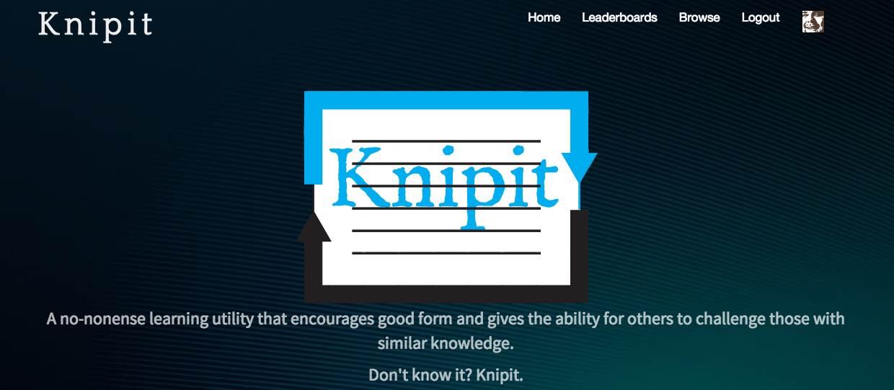
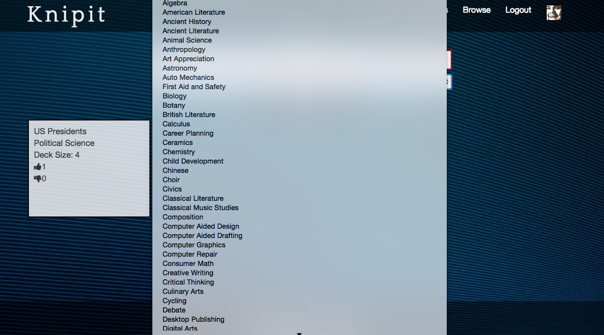
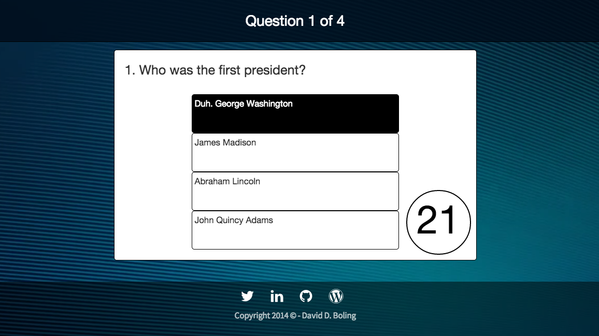
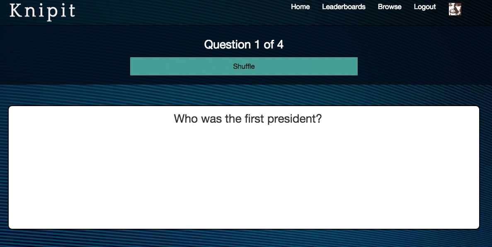
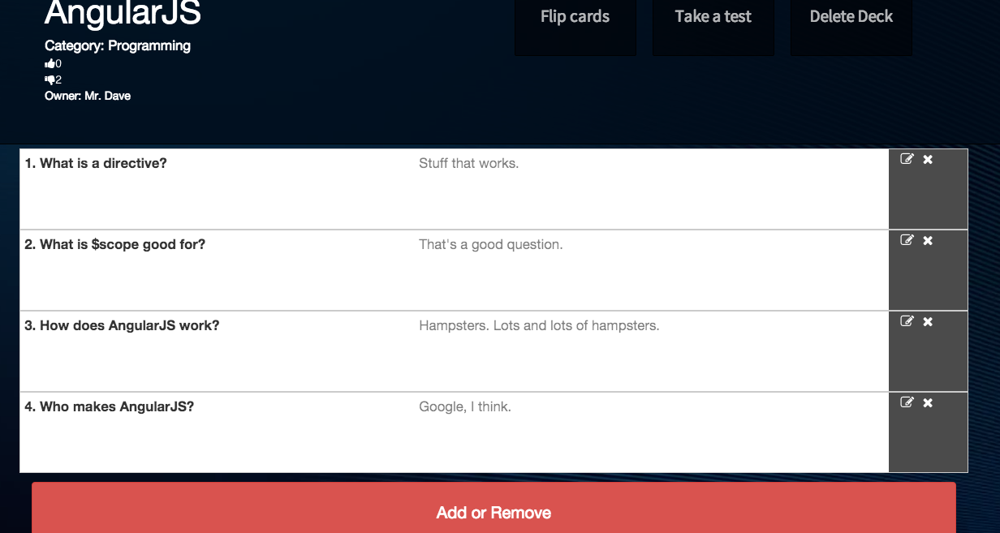

## Knipit

### Description
> Know it. Prove it?

A no-nonense learning utility that encourages good form and gives the ability for others to challenge those with similar knowledge.

Don't know it? Knipit.

### Features
- Login and logout
- String search
- Search filters
- Making of flashcard decks
- Flipping flash cards
- Test mode for flash cards
- Challenge mode of flash cards
- Edit/Delete/Create flash cards for each deck
- Leaderboards for users participating in challenge mode

### Built-on
- MongoDB
- Express
- AngularJS
- NodeJS

### Contributors
- [David D. Boling](https://github.com/kadowi)

### License
[MIT](LICENSE)

